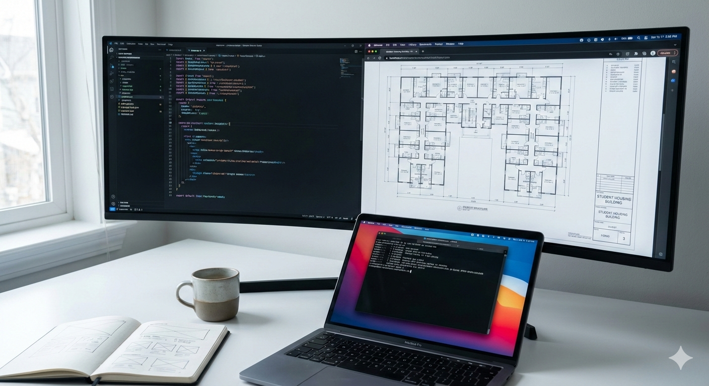

  
  <h1>Paul Ogutu</h1>
  
<strong>Software Engineer | Product Builder | Full-Stack Specialist</strong>

  

    
    
  

---

### About

I specialize in engineering **product-grade, end-to-end systems** designed for real-world operational constraints. My focus is on clean frontend architecture, pragmatic backend design, and delivering software that prioritizes user experience and maintainability.

---

### Technical Proficiency

| Category | Technologies |
| :--- | :--- |
| **Frontend** |     |
| **Backend** |     |
| **Operations** |    |

---

### Selected Projects

| Project | Summary | Core Stack |
| :--- | :--- | :--- |
| **Rumia** | Full-stack rental management system for student housing. | **Django, React, PostgreSQL** |
| **Aqua UI** | High-fidelity generative chatbot interface with optimized UX. | **Next.js, TypeScript** |
| **KEWASNET** | Collaborative development of a scalable chatbot platform. | **React, Django, REST** |
| **Auth Service** | Standalone identity and user management service. | **FastAPI, Docker, Pytest** |

---

### Professional Services

* **Production MVPs:** Full-cycle development from conceptualization to deployment.
* **Frontend Architecture:** Scaling React/Next.js applications with robust state management.
* **API Development:** Secure, high-performance Django and FastAPI backend systems.

 

  
  
  
   
   
  Build deliberately. Ship responsibly.

